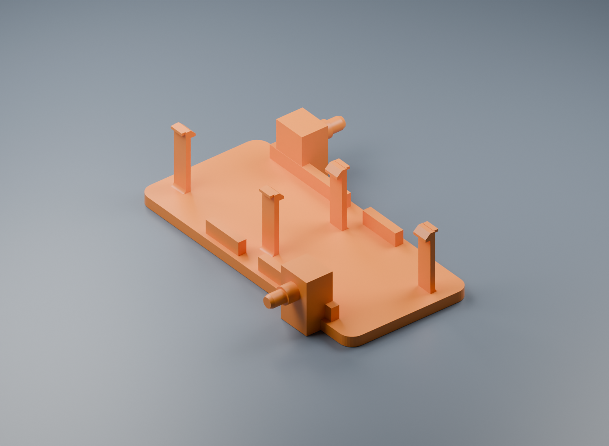
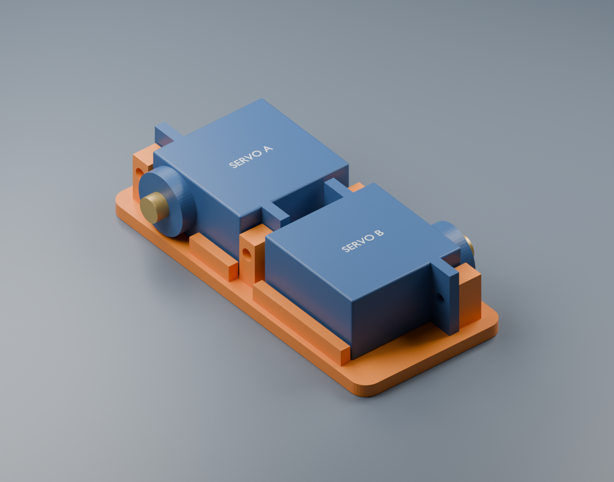

# Diagonal Spy Car

An open-source, 3D-printable rover using two owned MG90S-style continuous servos, a LOLIN ESP32-S2 Mini, and diagonal drive wheels. Inspired by [Pro Know DIY's micro RC FPV car](https://github.com/proknowdiy/micro_rc_fpv_car_esp-now).

## Complete Blender assembly - revision 0.6.0

Open the [complete Blender model](cad/complete/complete-spy-car.blend) for assembled and exploded scenes, detailed component references, routed wiring, and the removable electronics carrier. The battery, owned large buck and S2 Mini fit in one layer on a **52 x 76 mm deck**. The integral printed axles are preserved. The simplified revision removes the battery-sensing perfboard, its transistors/resistors, ADC capacitor, signal wiring and printed holder. The fuse, two power capacitors and positive-only `J_PWR` remain. Battery checks are manual; there is no onboard voltage monitoring or low-voltage stop.

Get the [new printed parts and assembly instructions](cad/complete/README.md), [dimension assumptions and sources](cad/complete/README.md#what-is-accurate-and-what-still-needs-measurement), and [geometry validation report](cad/complete/validation.json). This is a complete nominal prototype; the owned buck, servo and horn geometry still requires measurements.

## Picture wiring guide and current electronics

Use the [seven-page illustrated wiring PDF](output/pdf/spy-car-wiring-guide.pdf), [step-by-step wiring notes](electronics/wiring.md), and [camera-free electronics BOM](electronics/camera-free-bom.csv). This revision selects the owned large LM2596-style buck at 5.00 V and a Lumenier 300 mAh 2S XT30 battery (48 x 17 x 12 mm). Converter identity and loaded performance still need confirmation; neither owned board supplies LiPo charging or cutoff. The guide includes exact S2 pad callouts, manual per-cell battery checks, USB isolation and connector matching.

**Routine firmware updates use Espressif's bundled HTTPUpdateServer:** after one USB installation and private password setup, hold the S2 Mini's BOOT/0 button for three seconds after normal startup, join `SpyCar-Update`, and upload the receiver application at `http://192.168.4.1/update`. Driving stays locked during updates. No extra power switch or onboard hardware is needed; USB remains for initial setup and recovery. Read the [wireless update instructions and bench verification limits](firmware/README.md#wireless-receiver-updates). This feature is software-tested, not yet verified on the physical car.

## Browser joystick remote

The S2 Mini now serves a simple phone or desktop joystick at **http://spy-car.local/** using the same existing-Wi-Fi + mDNS approach as auto-switch. Hold and drag for proportional forward/reverse, curved turns and spins; release to stop. An optional **SpyCar** Wi-Fi network works away from your router. No app, internet service or second ESP32 is required. The existing handheld remains an optional firmware mode.

Read the [network setup, calibration and testing instructions](firmware/README.md#browser-remote-control). Software and simulated browser checks pass; actual networking and servo behavior still require a wheels-raised test on the car. Firmware defaults keep motion disabled until servo calibration is confirmed.

## Earlier mechanical stage: integral printed axles

The latest [revision 0.4 model](cad/rolling/README.md) makes both passive-wheel axles **part of the printed chassis**, with integral shoulders and servo retaining clips. Bearings press-fit into the wheels and onto the stationary pegs. There are **no added screws, nuts, caps or separate spacers** in this mechanical stage: only the owned servos and two MR83ZZ bearings are purchased parts.

Open the [wheel-only Blender model](cad/rolling/rolling-chassis.blend), get the [chassis, wheel and two fit-coupon STLs](cad/rolling/README.md), or review [the simplified bearing parts list](docs/passive-wheel-parts.md). The illustrated footprint is approximately **50 × 70 mm** with 30 mm wheels. Printed friction fits and clips need physical validation; the powered wheels remain size envelopes pending their horn attachments.

## Previous step: compact servo bracket

The current direction drops the camera and places the two servo bodies directly alongside each other, with one rotated 180 degrees so their shafts emerge at diagonal corners. The first model is a **30 × 66 mm one-piece bracket** with four mounting-ear screw points. It is a nominal fit prototype; measure the owned servos before relying on the hole positions.

Open the [Blender model](cad/compact/servo-pair.blend), download the [bracket STL](cad/compact/servo-pair-bracket.stl), or read the [compact model notes and parameters](cad/compact/README.md). The [camera-free battery and regulator shortlist](docs/compact-shopping.md) supports the next electronics-layout step. This first bracket has no electronics deck or wheel mounts yet; the complete camera-free assembly above supersedes this first bracket.

## Archived early concept

The original camera-equipped revision used different batteries, regulators and power monitoring. Its [CAD](cad/diagonal-spy-car.blend), [BOM](BOM.md), and [power research](docs/power.md) are historical references. Build from the current [complete assembly instructions](cad/complete/README.md), [electronics BOM](electronics/camera-free-bom.csv), and [firmware instructions](firmware/README.md).

## Rebuilding the current assembly

Follow the [complete assembly rebuild and verification instructions](cad/complete/README.md#rebuild-and-verification). The build scripts regenerate the deck STL and model; `power_update.py` then applies the fuse, connector and harness details and renders the current views. Fit, electrical loading and actual driving still require physical prototype checks.

## License and provenance

Original CAD, scripts, firmware and documentation are released under the **[MIT License](LICENSE)**. Brand names identify compatible purchased parts; no affiliation or endorsement is claimed. This is an original design inspired by the linked project; no upstream code, meshes or PCB files are redistributed. Source links identify which dimensions are published and which are assumptions. See [third-party notes](THIRD_PARTY.md).
