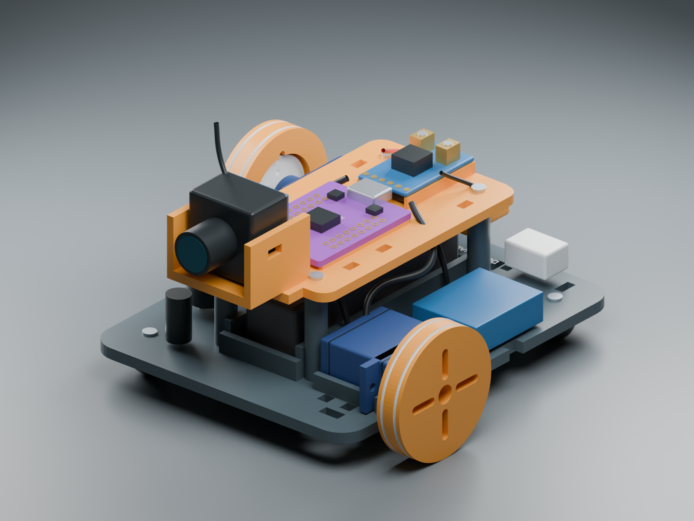
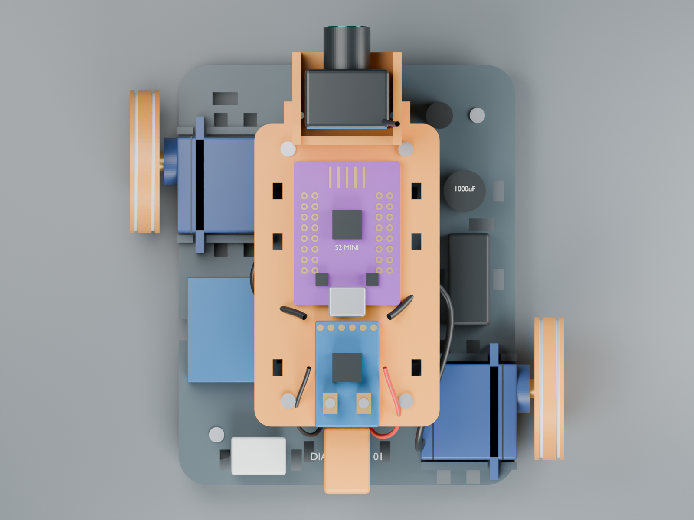
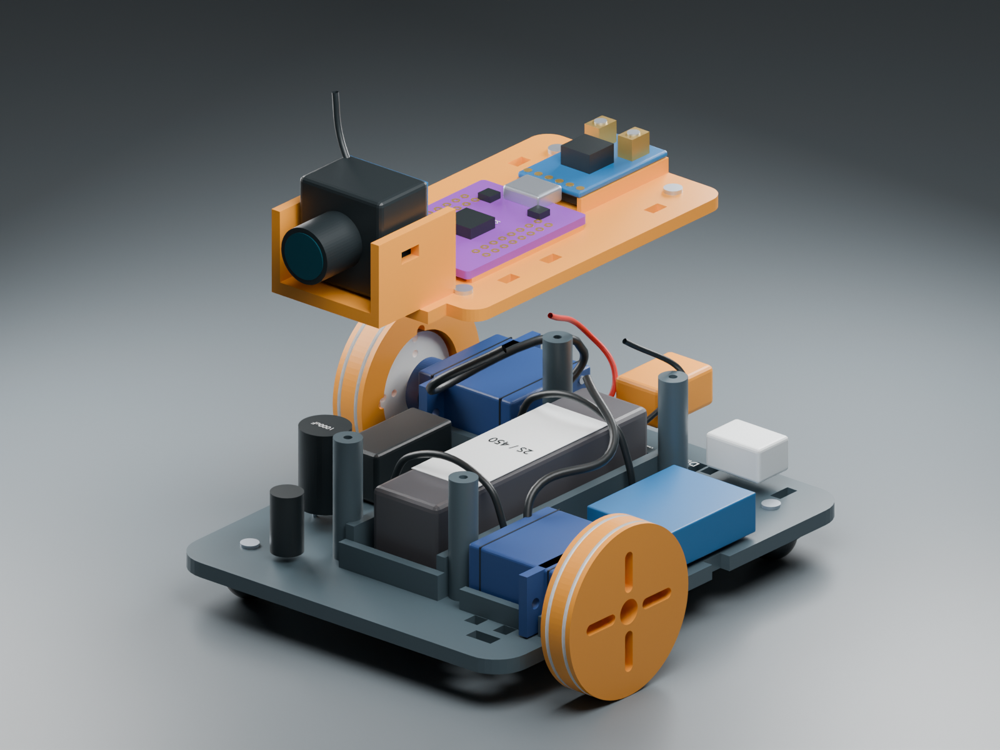

# Diagonal Spy Car

An open-source, 3D-printable rover using two owned MG90S-style continuous servos, a LOLIN ESP32-S2 Mini, and diagonal drive wheels. Inspired by [Pro Know DIY's micro RC FPV car](https://github.com/proknowdiy/micro_rc_fpv_car_esp-now).

## Current work: compact servo bracket

The current direction drops the camera and places the two servo bodies directly alongside each other, with one rotated 180 degrees so their shafts emerge at diagonal corners. The first model is a **30 × 66 mm one-piece bracket** with four mounting-ear screw points. It is a nominal fit prototype; measure the owned servos before relying on the hole positions.


Open the [Blender model](cad/compact/servo-pair.blend), download the [bracket STL](cad/compact/servo-pair-bracket.stl), or read the [compact model notes and parameters](cad/compact/README.md). The [camera-free battery and regulator shortlist](docs/compact-shopping.md) supports the next electronics-layout step. This first bracket has no electronics deck or wheel mounts yet; the earlier full-car CAD and firmware below have not been converted to the compact camera-free design.

## Earlier full-car prototype (revision 0.1)

**Revision 0.1 is an unbuilt engineering prototype.** The Blender models use published component outlines and clearly marked assumed details. They are not exact replicas of unmeasured servo clones or the camera. Measure your actual parts and print the fit coupon before the chassis. Diagonal wheels require sideways scrub to turn; the intended first test surface is a smooth indoor floor.



## The design

- Front-left and rear-right 34 mm drive wheels, attached to the servos' original horns. Printed low-friction skid feet support the other corners.
- An approximately **103 × 111 mm** assembled footprint, an 81 × 100 mm lower tray, a removable upper deck, and an adjustable padded camera cradle. Antenna envelope reaches about 73 mm high.
- A removable **Tattu 450 mAh 2S 75C long LiPo**, part `TA-75C-450-2S1P-L-XT30`, nominal 61 × 16 × 15 mm.
- **Pololu D30V30MALCMA (#4872)** adjusted to 5.00 V, with a calibrated 6.2 V backup cutoff. Firmware stops motion at 7.0 V. Charge the removed pack with a 2S balance charger at 0.4 A.
- The creator-linked **IDC-681H 25 mW / 40CH / 600TVL M7** analog FPV camera. Confirm its actual voltage rating and dimensions before purchasing/connecting. A separate compatible 5.8 GHz receiver or goggles displays video.
- Encrypted ESP-NOW control from a second classic ESP32 and analog joystick, with a held deadman button, 250 ms link timeout, neutral rearming and conservative speed ramp.

**No custom PCB is required for this prototype.** The servos already include motor electronics. Use the purchased buck module and an insulated soldered distribution harness, with a small through-hole perfboard for switched battery sensing. The original project's uploaded MX1508 PCB does not match its servo firmware/video and is not a suitable plug-in solution. Neither the S2 mini nor that reference PCB provides the required battery charging/protection system. [Evidence and schematic review](docs/reference-project.md).

The preliminary power budget suggests **15–30 minutes**, not a measured runtime. The battery, buck and sensing MOSFET have a researched price subtotal of **$48.92**; that excludes camera, charger, viewing hardware and consumables. The buck was listed as rationed/backordered. See the linked sources and caveats in the [power design](docs/power.md).

## Files and build order

1. Review [component evidence](docs/component-sources.md), [mechanics](docs/mechanics.md), and the [measurement checklist](docs/measurement-checklist.md).
2. Open **[components.blend](cad/components.blend)** for the purchased-part reference library, then **[diagonal-spy-car.blend](cad/diagonal-spy-car.blend)** for the assembled chassis. Collections distinguish printed parts, nominal hardware and illustrative details. The component library shares assembly coordinates.
3. Check **[BOM.md](BOM.md)** or **[BOM.csv](BOM.csv)** for all 40 line items, including owned parts, controller, FPV receiver, charging equipment and consumables.
4. Print `stl/08_fit_coupon.stl`, then validate a wheel against your actual horn. Follow [printing and assembly](docs/assembly.md) for the remaining seven STLs.
5. Build and verify the [wiring](electronics/wiring.md), then configure and upload the [firmware](firmware/README.md). Defaults prevent arming until pairing and calibration are configured.
6. Complete the [validation checklist](docs/validation.md) before ground driving.

Do not connect the 2S battery directly to a servo, camera, or the S2 Mini. Disconnect the car battery before ordinary USB programming; the S2's 5 V header is connected to USB VBUS. Lift the removable S2 for USB access in this compact layout. Software and pack-level cutoff do not provide individual-cell protection or disconnect a mechanically stalled servo; the accessible XT30 is the hard power disconnect.

## Rebuilding the Blender design

Requires Blender 5.x (generated with 5.2.1 LTS). From the repository root:

```sh
blender --background --python-exit-code 1 --python cad/build.py
blender --background cad/diagonal-spy-car.blend --python-exit-code 1 --python scripts/validate_blender.py
python3 scripts/build_bom.py
python3 scripts/verify_artifacts.py
```

On macOS, replace `blender` with `/Applications/Blender.app/Contents/MacOS/Blender` if needed. `build.py` creates both `.blend` files, eight binary STLs in millimetres, three renderings, and a mesh report. STLs are individually centered and oriented at Z=0. Blender scene unit scale is 0.001 metres per coordinate unit.

`cad/parameters.json` controls core component envelopes and wheel/chassis dimensions. Detailed mating features and layout coordinates also live in `cad/build.py`; this is a scripted CAD design, not an automatic constraint solver. Changing a part requires updating its mounts and rerunning clearance checks. The measured prototype should become a new revision, preserving the assumptions recorded here.





## License and provenance

Original CAD, scripts, firmware and documentation are released under the **[MIT License](LICENSE)**. Brand names identify compatible purchased parts; no affiliation or endorsement is claimed. This is an original design inspired by the linked project; no upstream code, meshes or PCB files are redistributed. Source links identify which dimensions are published and which are assumptions. See [third-party notes](THIRD_PARTY.md).
