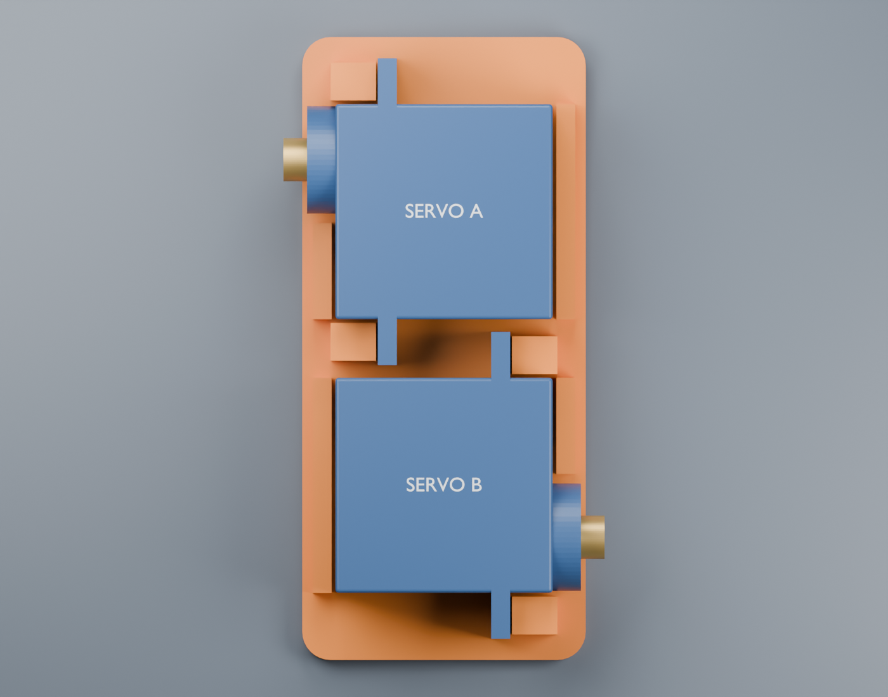
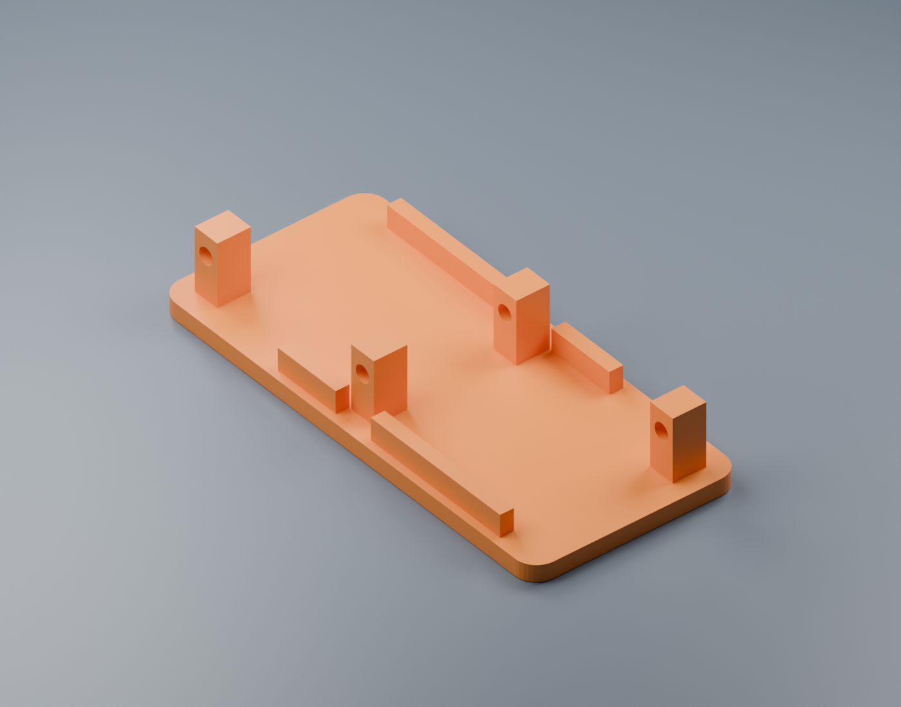

# Compact opposing servo pair — first fit model

This follows the side-by-side arrangement in the user's sketch: both servo bodies share the same lateral centerline, in two adjacent front/back lanes. The second servo is rotated 180 degrees about the vertical axis. Their output shafts point outward at diagonal corners. Original mounting ears remain intact.




## Files

- [servo-pair.blend](servo-pair.blend): editable Blender assembly, with separate collections for the single printed bracket, servo A, servo B, labels and studio.
- [servo-pair-bracket.stl](servo-pair-bracket.stl): only the bracket, in millimetres, flat underside at Z=0.
- [parameters.json](parameters.json): adjustable component assumptions and bracket dimensions.
- [build.py](build.py): source generator, STL export and nominal clearance/topology checks.
- [validation.json](validation.json): generated dimensional and geometry report.

## Geometry

The bracket is **30 × 66 × 11.5 mm**, with a 2.4 mm floor. The nominal servo assembly is **34 × 66 × 14.6 mm**, including bare output shafts, excluding horns, screws, wiring and wheels.

Cases occupy adjacent lanes separated by 29 mm center-to-center. This leaves 1.35 mm between each inner mounting-tab tip and the neighboring case. Shaft tips sit at X/Y coordinates (-17, +20) and (+17, -20) mm. Both shaft centerlines are 8.5 mm above the bracket underside. Front is +Y; the shafts point along opposite X directions, parallel to one another.

Four low locating rails provide 0.4 mm clearance beside the nominal cases; two rails have openings around the output bosses. Four printed posts align with the assumed mounting-ear holes. Their 2.4 mm screw-clearance holes run horizontally along X. Hardware is not printed into the STL.



This is a **fit prototype**, not an exact replica of the owned servo clones. The body-height assumption, mounting-ear thickness/position, hole pitch, shaft offset and cable exits need checking against the actual servos. There is no electronic deck, wheel hub or passive wheel mount in this first model. The floor width reserves clearance for later wheels; wheel and horn fit still requires a separate check.

## First print and assembly

Print the STL flat underside down. A practical starting point is 0.2 mm layers and four perimeters with a 0.4 mm nozzle. Inspect the slicer preview around the small horizontal holes; clean out sagging plastic if necessary. The first print is for checking fit before a loaded driving test.

1. Seat both servos in the orientation shown, without forcing their cases or tabs. Check the cable exits and body width first.
2. Check all four ear holes against the printed posts. Assumed ear-hole pitch is 27.6 mm; change the parameters and reprint if it differs. Do not force screws through misaligned ears.
3. Trial-fit M2 through screws, washers and nuts if the actual ear holes accept M2. The nominal post + gap + ear stack is 7.0 mm before washers and nut; screw length must be selected against the measured hardware stack. Screws, nuts and tool-access envelopes are not yet modeled or validated.
4. Tighten gently, only enough to retain the case. Confirm the shafts turn without touching the bracket. Check that neither servo cable is pinched.

Retaining the supplied ears is the intended attachment. If the clone's tabs differ substantially, update the model rather than cutting the tabs off. The posts are deliberately small for this compact arrangement; strength and fatigue have not been tested.

## Rebuild

From the repository root:

```sh
blender --background --python-exit-code 1 --python cad/compact/build.py
```

On macOS the Blender executable can be `/Applications/Blender.app/Contents/MacOS/Blender`. Add `-- --skip-renders` for geometry/export/validation only. This generator does not modify the earlier revision 0.1 assembly.

The generator checks that the bracket has one connected component, positive volume and zero non-manifold edges; that the bracket does not intersect the nominal servo solids; and that the two servos do not intersect one another. The model checks do not establish measured fit, print strength, cable clearance, screw/nut access or driving performance. Diagonal drive will require sideways tire scrub during turns.
