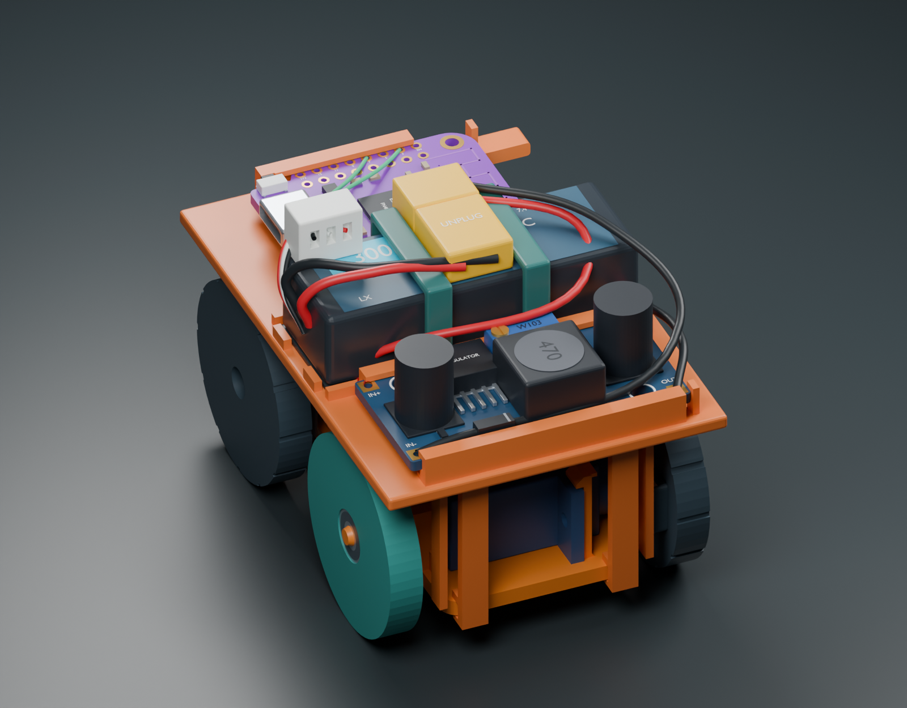
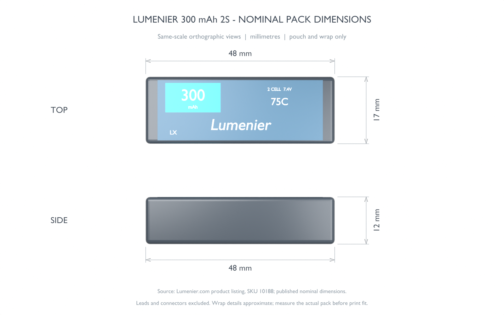
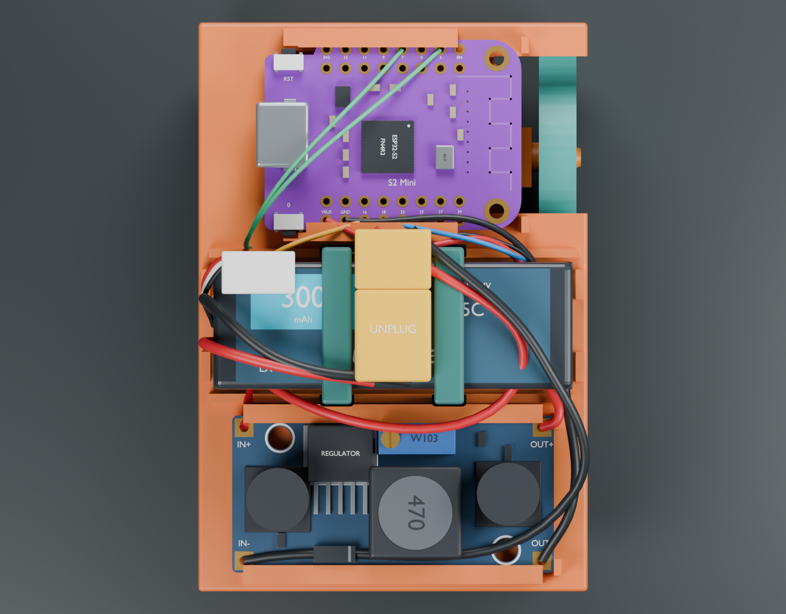
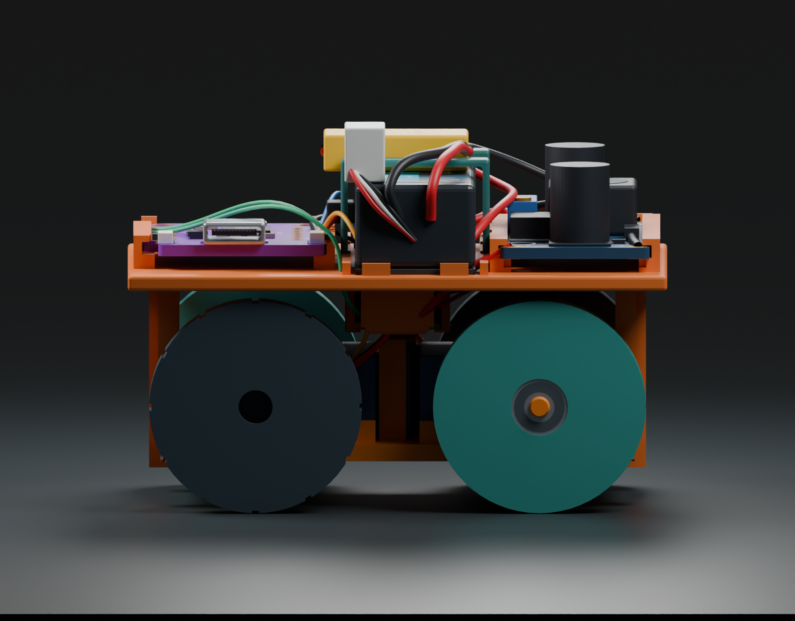
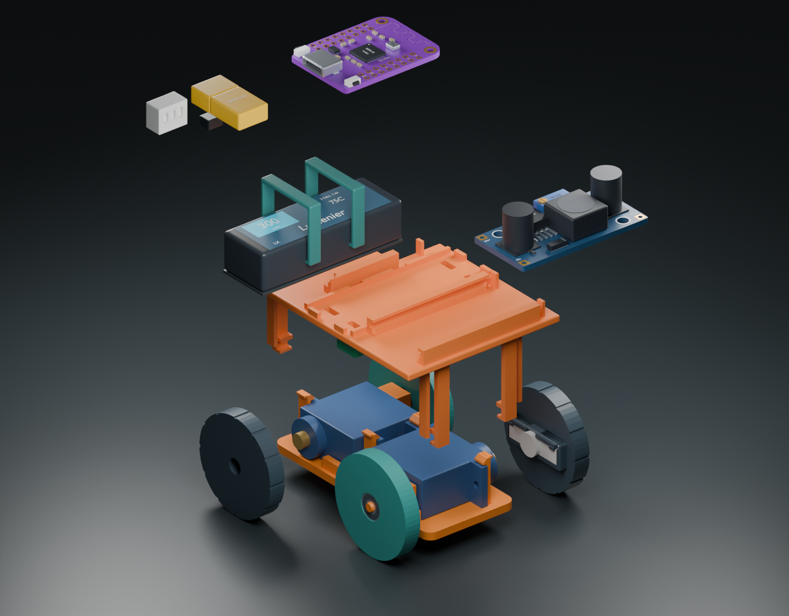

# Complete camera-free assembly - revision 0.5.1

Open **[complete-spy-car.blend](complete-spy-car.blend)**. It contains `01 ASSEMBLED`, `02 EXPLODED`, and `03 BATTERY DIMENSIONS` scenes, named component collections, millimetre units, and source/confidence properties on the new electronics objects. The exploded scene hides loose wire curves to expose the parts.



The battery, buck and S2 sit in one layer on a **52 x 76 mm removable printed deck**. This is slightly wider and longer than the wheel-only revision, but avoids stacking the buck above the S2. The main platform underside is 25 mm above the model origin, giving **1.5 mm nominal clearance above the 30 mm wheels**. Inspect [validation.json](validation.json) for the actual assembled bounds, including reference connectors and routed wires.

## Battery dimension correction



The selected pack is the **Lumenier 300 mAh 2S XT30, SKU 10188**. Its manufacturer lists **48 mm long × 17 mm wide × 12 mm high**. In the assembled car these are X × Y × Z: the 48 mm length runs across the deck. This is the same pack photographed in the wiring guide; the guide photo is not a scale drawing.

An audit of the previous saved model found a **48 × 17 × 11.84 mm wrap** with a thin label above it. Length and width were already correct. Revision 0.5.1 brings the finished wrap and label to **48 × 17 × 12 mm**, rounds the wrap more softly, and turns the label artwork along the long axis as shown in the product photo. The dimensions scene uses copies of the actual battery geometry at identical scale, without the straps and plugs obscuring its top. Artwork, folds and lead exits remain photo-derived approximations.

The corrected finished pack sits at **Z 28–40 mm**, directly above the 0.8 mm pad. The existing carrier accommodates it: nominal clearance is **0.4 mm at each end stop**, **1 mm per side inside each band**, and **1.2 mm above the pack inside the band**. The printed carrier and bands therefore do not need resizing. These are CAD clearances, not a validated elastic grip or supplier tolerance allowance. Measure the purchased pack before final fit.

The build measures the actual transformed geometry and rejects a deviation greater than **0.01 mm** from the nominal envelope; this computational threshold is not a manufacturing tolerance. Dimensions exclude leads, connectors and padding. Sources: [manufacturer specifications and product photos](https://www.lumenier.com/products/lumenier-300mah-2s-75c-lipo-battery-xt-30), [wiring guide](../../output/pdf/spy-car-wiring-guide.pdf). No published dimensioned manufacturing drawing or measured physical pack is available, so a perfect replica cannot yet be established.

## Included in the model

- The unchanged [revision 0.4 chassis](../rolling/README.md), including its two integral bearing axles and four servo retaining clips.
- Both nominal MG90S-style servo cases, ears, bosses and shafts; two MR83ZZ 3 x 8 x 3 mm bearings; two passive press-fit wheels.
- New powered wheels with keyed pockets for assumed factory double-arm horns, relieved retaining tongues, and center-screw access. The **original horn and supplied servo center screw** remain part of the owned servo assembly. No replacement spline is invented and no new mounting screws are specified.
- Detailed Lumenier 300 mAh 2S battery, large LM2596-style module and LOLIN S2 Mini, including drilled PCB pads, reference mounting holes, USB shell, switches, antenna, IC packages, capacitor markings and PCB labels.
- XT30 mating connector reference, balance connector, removable `J_PWR`, fuse, bulk and bypass capacitors, gated battery-sensing perfboard, two transistors, six resistors, and the separate ADC filter capacitor.
- Named power, ground and GPIO wire routes. Battery and board endpoints use the modeled terminal coordinates. These are packaging/service-loop references, **not a replacement for the [electrical guide](../../electronics/wiring.md)** or a production harness drawing.

The camera and external charging/transmitter equipment are not mounted on this camera-free car. Existing receiver firmware still uses the separate ESP-NOW transmitter and requires commissioning; this CAD update does not implement a phone controller.

## What is accurate, and what still needs measurement

| Feature | Model basis |
| --- | --- |
| Battery pouch envelope | Published **48 x 17 x 12 mm** for the selected [Lumenier pack](https://www.racedayquads.com/products/lumenier-300mah-2s-75c-lipo-battery-xt-30). Lead lengths, exit shape, wrap/seams and exact connector subtype remain approximations. |
| S2 PCB | Official **34.3 x 25.4 mm** outline, **2 mm holes** and **20.4 mm transverse hole spacing** from [WEMOS](https://docs.wemos.cc/en/latest/_static/files/dim_s2_mini_v1.0.0.pdf). Hole Y, corner/notch details and component locations are image-derived nominal assumptions. |
| S2 headers | Nominal 2.54 mm pitch, columns at X +/-11.43 and +/-8.89 mm before rotation, supported by official photographs and the [KiCad footprint contribution](https://gitlab.com/kicad/libraries/kicad-footprints/-/merge_requests/2904). These coordinates are not fully specified in the WEMOS mechanical drawing. |
| S2 main IC | **7 x 7 x 0.85 mm nominal** QFN package from [Espressif](https://documentation.espressif.com/esp32-s2_datasheet_en.pdf). PCB thickness 1.6 mm, USB and other package heights are unmeasured assumptions. |
| Owned buck | **43 x 21 x 14 mm provisional envelope**, based on a [comparable manufacturer's module](https://wiki.kamamilabs.com/index.php?title=KAmod_LM2596), with component arrangement informed by the user's photograph. Other generic modules differ; no measurement or readable IC marking establishes this exact board size/type. |
| Servos and horns | Inherited nominal servo geometry; **not measured clones**. The assumed 20 x 5 x 2 mm horn and 7 mm hub require verification. Factory screw dimensions are illustrative; actual horn/spline engagement controls the fit. |
| Bearings | Nominal MR83ZZ envelope. Shield detail is illustrative; internal rolling-element geometry is not modeled. |
| Small packages and connectors | Packaging references. The fuse, passive packages, perfboard layout, solder heights and wire bend radii must follow the actual purchased parts. The user's yellow pigtails have not been established as XT30 rather than XT60. |

This is a complete **nominal assembly**, not an exact scan or a claim of physically tested fit. Object properties retain the distinctions rather than presenting decorative detail as measurement evidence.

See the [assembly parts list](parts.csv) alongside the [electrical BOM](../../electronics/camera-free-bom.csv).

## Printed parts and assembly

1. Keep the [existing chassis and passive wheel STL files](../rolling/README.md), including both bearing/axle fit coupons. Axles remain integral to the chassis.
2. Print [electronics-deck.stl](electronics-deck.stl) in PETG as a fit prototype. Four independent end fingers wrap around the base; upper ledges carry the weight and lower hooks prevent lift. End-local guides locate it sideways. The tall fingers, underdeck holders and rail overhangs require an intentional support/orientation plan; inspect the slicer preview before printing.
3. Install the small sensing perfboard, fuse and bulk capacitor under the deck. Their carrier/end stops and capacitor cradle are printed into the deck. Leave service slack so the deck can be removed. Actual component heights must fit the verified rigid clearances.
4. Slide the buck and S2 into their board-edge rails from the open end, before attaching the harness. PCB retention is a nominal friction fit with a far-end stop. Inspect underside solder clearance, button access and edge contact on the delivered boards; do not force a board into the rails.
5. Add 0.8 mm protective padding under the battery. Print **two** [battery-band-tpu.stl](battery-band-tpu.stl) loops in TPU; their slots and clearances retain the pack without a rigid high-force clamp on the pouch. Check the actual pack with its wrap and leads. The model does not imply that PETG is a substitute for these flexible loops.
6. Use [powered-wheel-left.stl](powered-wheel-left.stl) and [powered-wheel-right.stl](powered-wheel-right.stl) only after checking the assumed horn pocket against the supplied horns. Retaining tongues have axial relief and rounded lead-ins, but insertion force, fatigue and torque retention are untested. Keep the supplied horn screw accessible through the wheel center; do not force or replace the servo spline with printed teeth.
7. Use the labeled wiring guide, not color alone, to connect the harness. Leave USB and the XT30 disconnect accessible. Neither the buck nor the model supplies battery charging or low-voltage disconnection.





## Rebuild and verification

```sh
/Applications/Blender.app/Contents/MacOS/Blender --background --python-exit-code 1 --python cad/complete/build.py
```

Add `-- --skip-renders` to regenerate geometry, STL checks and the Blender file without PNGs. The builder reads the saved revision 0.4 model and does not overwrite it. To use a separate known base without importing local chassis edits, append `--base-model /absolute/path/to/base.blend` after `--`; `validation.json` records its SHA-256. This battery revision used the committed base and preserved the locally edited rolling model. `parameters.json` supplies the new component envelopes and placement; detailed mating features and routing are also design constants in `build.py`. Changing a component requires updating its mount and revalidating, not only changing one dimension.

The build checks exported STL topology using the exact serialized float32 coordinates, positive volume, one connected component, winding, degenerate faces and closed edges. Boolean intersection checks cover the new printed mounts, inherited rigid assembly, primary electronic models, factory horn references, and selected rigid accessory packages. Internal decorative layers within one purchased component intentionally overlap and are not a manufacturing representation.

Static checks do not validate print tolerances, snap insertion, dynamic wheel runout, strength, heat, antenna performance, wire chafe, electrical behavior or service access with actual plugs. Those remain physical prototype checks.

The wiring PDF was corrected in commit `582252d`: in the supplied upright buck photograph, **IN+ is lower left and IN- lower right**. Both positive terminals are on the left before the board is rotated in this assembly. The current model and guide use that corrected mapping.
