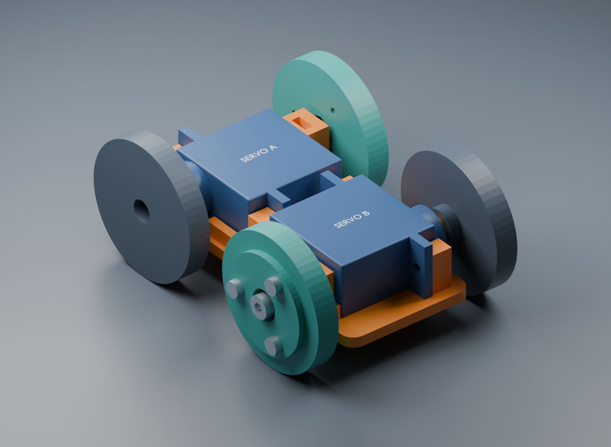
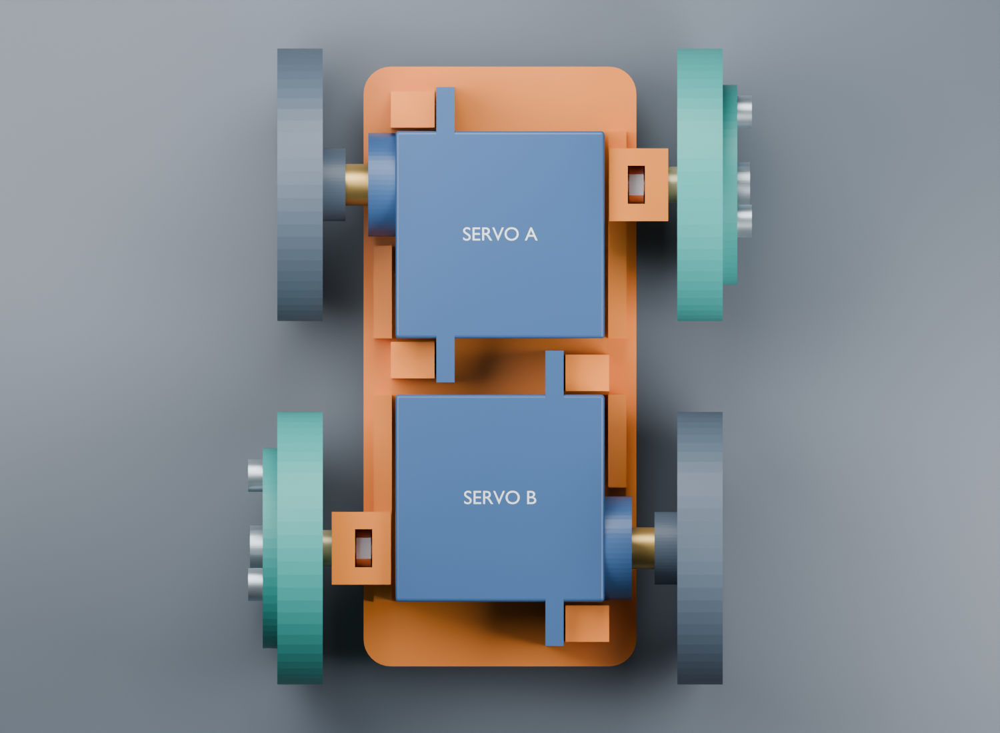
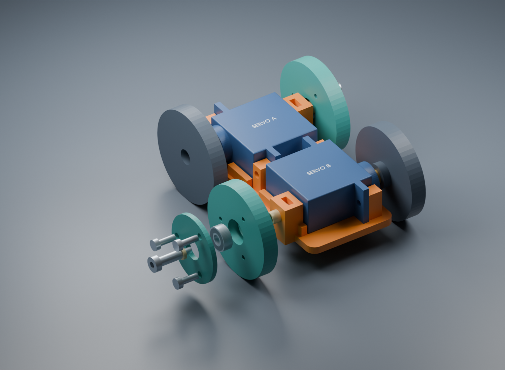

# Aligned passive wheels — revision 0.3

Two fixed stub axles support the free-spinning wheels at the open corners. Each shares the **same Y and Z coordinates as the powered servo shaft opposite it**. There is no physical axle passing through either servo.



## Arrangement and dimensions

Viewed from above, front (+Y) at the top:

```text
          LEFT                      RIGHT
          powered ─── servo A ─────── free       Y = +20 mm
          free ────── servo B ─────── powered    Y = -20 mm
```

All four wheel axes run along X at **Z = 8.5 mm** above the chassis underside. Wheel tread centers are X = ±22 mm, providing a 44 mm track and 40 mm wheelbase. The wheels are 30 mm diameter; the two passive wheel bodies are 5 mm wide plus their retaining caps. The nominal illustrated envelope is **55.4 × 70 × 30 mm**, including the assumed cap-screw heads. Ground clearance under the chassis is 6.5 mm with these wheel diameters. Added tires would change both diameter and ground clearance.



The chassis itself is **37 × 66 × 12.5 mm** at its widest axle supports. This replaces the original compact bracket for this wheel arrangement. The [earlier servo-pair model](../compact/README.md) remains available separately.

## What turns

Each teal wheel holds one **MR83ZZ bearing, 3 mm bore × 8 mm OD × 3 mm wide**. Its outer ring turns with the wheel. Its inner ring sits on a stationary 3 mm smooth steel shoulder screw, fastened into an M2 nut captured in the chassis.

The wheel's bearing pocket has a nominal 8.1 mm diameter and 3.2 mm depth. A ledge behind the bearing and a removable cap in front retain only the outer rim. Both have a **7 mm center opening**, clearing the inner ring, stationary spacers and screw head. The cap uses three M2 screws. The 8.1 mm diameter is a printer-fit starting point; use the coupon before committing to it.



From the chassis outward, the stationary axial stack is:

| Feature | Nominal dimension |
|---|---:|
| Smooth shoulder seated into chassis | 1.0 mm |
| Inner-ring spacer beside chassis | 2.8 mm long, 4 mm OD / 3.2 mm ID |
| MR83ZZ bearing | 3.0 mm wide |
| Inner-ring spacer beside screw head | 1.0 mm long, 4 mm OD / 3.2 mm ID |
| Total allocation along shoulder | 7.8 mm |
| Selected smooth shoulder | 8.0 mm, with supplier tolerance up to +0.25 mm |
| Nominal available axial clearance | 0.2 mm, before manufacturing variation |

The 5 mm screw head must not bear directly on the bearing shield. The small spacers contact only the inner ring. The bearing's outer-rim retainer also has 0.2 mm nominal axial clearance. These clearances and the supplier's shoulder length tolerance must be checked together on the real assembly; they do not guarantee zero wobble or preload-free operation.

## Files and quantities

Open [rolling-chassis.blend](rolling-chassis.blend) for the editable assembly. Parameters are in [parameters.json](parameters.json); generation is in [build.py](build.py).

| Printable file | Quantity | Print orientation |
|---|---:|---|
| [rolling-chassis.stl](rolling-chassis.stl) | 1 | Flat underside down |
| [passive-wheel.stl](passive-wheel.stl) | 2 | Bearing pocket opens up |
| [bearing-retainer.stl](bearing-retainer.stl) | 2 | Flat face down |
| [inner-spacer-2p8.stl](inner-spacer-2p8.stl) | 2 | Upright, bore vertical |
| [outer-spacer-1p0.stl](outer-spacer-1p0.stl) | 2 | Upright, bore vertical |
| [bearing-fit-coupon.stl](bearing-fit-coupon.stl) | 1 initially | Pockets open up |

All STLs use millimetres and are already oriented at Z=0. Purchased parts: **2 bearings, 2 shoulder screws, 2 M2 nuts and 6 provisional M2 × 6 mm cap screws**. Reuse the two servos and their mounting hardware from the previous bracket. See the [sourced parts list, photos and prices](../../docs/passive-wheel-parts.md). The bearing and shoulder-screw subtotal was **$15.58**, before shipping and other hardware.

## First assembly

1. Print the coupon first. From its **notched end**, pockets are 8.0, 8.1 and 8.2 mm. Choose the pocket that admits the bearing with light pressure on its **outer ring** and holds it concentrically without the outer ring spinning in the pocket. Do not force it using the inner ring. Set `wheel.bearing_seat_diameter` to the chosen value and regenerate the wheel files if needed.
2. Print the chassis, two wheels and caps. A 0.2 mm layer height and four perimeters are starting settings for the larger parts. Confirm the horizontal chassis holes and nut slots in the slicer. Select material and temperature settings appropriate to your printer.
3. Print or make the spacers. The supplied annulus has only **0.4 mm radial wall thickness**; verify a continuous extrusion path and measure the finished parts. Printed spacers are fit prototypes. The parts note describes a 3 mm ID / 4 mm OD metal-tube alternative if these do not print or hold up well.
4. Fit the servos as before. Drop one measured M2 nut into each axle support's top slot. The slot is outside the servo case and accessible before adding an electronics deck.
5. Seat a bearing in each wheel. Fit its retaining cap with three M2 × 6 mm screws, gently forming threads in the printed pilot holes. The nominal 6 mm screw tip remains 0.6 mm short of the wheel's inner face; verify your screw style and actual stack. Avoid overtightening the small plastic pilots.
6. Slide a 1.0 mm outer spacer onto a shoulder screw, then the wheel/bearing assembly, then the 2.8 mm inner spacer. Feed the threaded end into the support and captured nut. The 3 mm smooth portion seats 1 mm into the chassis socket; the threaded section remains entirely inboard of the bearing.
7. Snug the axle without crushing the printed seat, then spin the wheel by hand. It must turn freely with the axle secured, without the shield or cap rubbing. Measure and adjust the spacer stack if it binds or has excessive axial play. Repeat for the opposite corner.

## Scope and verification

This is an unbuilt **single-bearing fit prototype**. One bearing keeps the hub small but offers less resistance to wheel tilt than two spaced bearings. Check wobble and support stiffness before a loaded floor test. Four fixed-direction wheels turn by sideways tire scrub; the free wheels do not make this a caster-steered vehicle.

The dark powered wheels and their short horn-interface shapes are **context envelopes only**. Their final horn attachment is not designed or exported here. The powered and passive tread diameters must match for all four wheels to share the ground plane. Servo clone dimensions and mounting holes remain assumptions from revision 0.2. Electronics, wiring and the upper deck are not included.

[validation.json](validation.json) records no positive intersections between printed parts and the modeled hardware envelopes, plus checks of all six actual binary STLs for a closed connected solid, consistent winding, no duplicate/degenerate faces, positive volume and a base at Z=0. Cap screw threads intentionally engage plastic and are excluded from interference checks. Bearing internals, fastener fillets, physical tolerances and loaded behavior require hardware verification.

To rebuild from the repository root:

```sh
blender --background --python-exit-code 1 --python cad/rolling/build.py
python3 cad/rolling/mesh_checks.py
```

On macOS, use `/Applications/Blender.app/Contents/MacOS/Blender` if `blender` is not on PATH. Add `-- --skip-renders` to regenerate geometry and checks only. The generator reads the saved compact Blender assembly and asserts that its shaft positions match the compact parameter file; regenerate that input first if you change the original servo arrangement.
