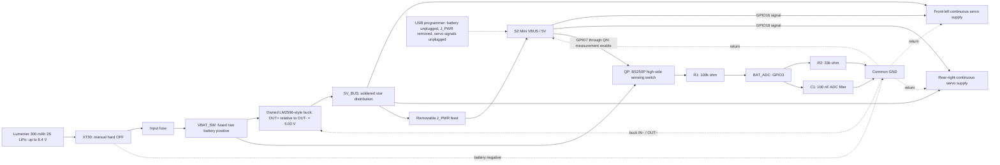
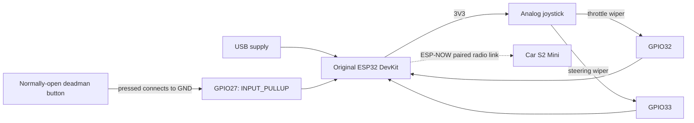

# Camera-free wiring and commissioning

**Current selection: the owned large LM2596-style adjustable buck, a Lumenier 300 mAh 2S LiPo with XT30, the S2 Mini, and two continuous-rotation servos.** This is a soldered harness and an untested electrical assembly. Use the [picture wiring guide](../output/pdf/spy-car-wiring-guide.pdf) and [current camera-free BOM](camera-free-bom.csv). The earlier Tattu/Pololu/FPV proposal in `docs/power.md` and root `BOM.md` is historical and does not describe this wiring.

The battery is 7.4 V nominal and 8.4 V fully charged. Adjust the converter output to **5.00 V before connecting any loads**. “LM2596-style” identifies the module family, not a verified manufacturer, continuous-current rating or protection specification. Confirm the markings and polarity on the owned board. No charger, servo motor driver or custom PCB is required on the car; each continuous servo contains its own motor driver.

## Car topology



`VBAT_SW` is the existing firmware/documentation net name for the fused battery feed; it does not imply an automatic power switch. Ground is a continuous electrical connection between battery negative, buck input/output negative, both servo grounds, S2 Mini GND and the divider bottom. Confirm input-negative/output-negative continuity with the converter unpowered. Keep servo current in the power harness, not through the S2 board, a GPIO, USB connector or solderless breadboard. Keep the ESP32 antenna away from the converter and motor wiring.

## Car net table

| Net / component label | Connect to | Requirement |
|---|---|---|
| Battery positive, XT30 harness side | Input fuse, then `VBAT_SW` | Preserve original battery leads; verify mating connector polarity |
| `VBAT_SW` | Buck `IN+`; QP source | Raw 2S voltage; never connect directly to a servo, S2 VBUS, 3V3 or GPIO |
| Battery negative | Buck `IN−` and common ground | Short 22 AWG or thicker supply wiring |
| Buck `OUT+` | `5V_BUS` | Set and measure **5.00 V** with all loads disconnected first |
| Buck `OUT−` | Common ground / soldered return distribution | Separate return branches for both servos and S2 |
| `5V_BUS` | Both servo positive supply inputs; `J_PWR` | Separate branches; no motor current through the MCU board |
| `J_PWR` removable feed | S2 Mini **VBUS / 5V** | Remove this feed before USB programming |
| S2 Mini `GND` | Common ground | Required for servo PWM signaling |
| S2 Mini **GPIO16** | Front-left servo signal | Firmware `LEFT_SERVO_PIN`; initially direct 3.3 V logic |
| S2 Mini **GPIO18** | Rear-right servo signal | Firmware `RIGHT_SERVO_PIN`; **not GPIO17** |
| Both servo grounds | Common ground | Identify supply, ground and signal from the actual units; colors/contact order are not proof |
| C_BULK **220 µF / 10 V** | Positive to `5V_BUS`; negative to GND | External capacitor near the servo power split; polarity matters |
| C_BYPASS **100 nF ceramic** | `5V_BUS` to GND | Short leads near the S2 supply branch; separate part from the ADC filter C1 |
| R1 **100 kΩ, 1%** | QP drain / `VBAT_SENSE` → `BAT_ADC` | Upper divider resistor; do not bypass QP |
| R2 **33 kΩ, 1%** | `BAT_ADC` → GND | Lower divider resistor |
| C1 **100 nF ceramic, ≥16 V** | `BAT_ADC` → GND | Place beside GPIO3 and R2; this is the ADC filter, not the 5 V bypass |
| S2 Mini **GPIO3** | `BAT_ADC` | **GPIO3 / ADC1_CH2**, not “ADC channel 3” |
| S2 Mini **GPIO7** | 10 kΩ → QN base | Battery-sense enable; LOW except during settled measurements |
| QP **Diodes BS250P** | Source = `VBAT_SW`; drain = `VBAT_SENSE`; gate = `SENSE_GATE` | P-channel high-side switch; source/drain orientation is essential |
| QN **onsemi 2N3904BU** | Emitter = GND; collector through 10 kΩ to `SENSE_GATE` | Keeps raw pack voltage away from the GPIO |
| R_GATE **100 kΩ** | QP gate → QP source | Default OFF pull-up |
| R_GATE_SER **10 kΩ** | QP gate → QN collector | Limits gate pull-down current |
| R_BASE **10 kΩ** | GPIO7 → QN base | Limits base current |
| R_BASE_PD **100 kΩ** | QN base → GND | Default OFF when MCU is unpowered or reset |
| Battery three-contact balance connector | Compatible 2S balance charger / per-cell monitor | Verify connector orientation and cell taps; never connect it directly to S2 pins |

Use a DC-rated input fuse and insulated holder selected for the battery fault current, wiring and measured inrush; do not call the fuse servo-stall protection. Keep supply/return wires short and use heatshrink and strain relief. The external **220 µF / 10 V plus 100 nF** values are starting decoupling, not a verified fix for voltage dips or inadequate converter capacity. Leave the buck's fitted capacitors in place. Use insulated perfboard for the sensing circuit and a suitably sized soldered harness for power distribution.

## Exact S2 Mini pads

The following positions are verified against the [official WEMOS pinout](https://docs.wemos.cc/en/latest/_images/s2_mini_v1.0.0_4_16x9.jpg). Hold the **component side toward you, antenna at the top, USB-C at the bottom**. Count only the eight small electrical pads in a column, starting at the top; ignore the large mounting holes. The underside is mirrored. Confirm the owned board revision and underside silkscreen before soldering.

| Required net | Physical pad in that top-view orientation | Neighbor that helps identify it |
|---|---|---|
| Regulated 5 V input | **Right outer column, row 8: VBUS** | Right inner row 8 is GPIO15; do not use it for power |
| GND | **Right outer column, row 7** | Right inner row 7 is also GND |
| Left servo signal GPIO16 | **Right outer column, row 6** | Right inner row 6 is GPIO17; not the right-servo signal |
| Right servo signal GPIO18 | **Right outer column, row 5** | Right inner row 5 is GPIO21 |
| Battery ADC GPIO3 | **Left outer column, row 2** | Left inner row 2 is GPIO2 |
| Sense-enable GPIO7 | **Left outer column, row 4** | Left inner row 4 is GPIO6 |

For a second check, the complete right outer column from top to bottom is **39, 37, 35, 33, 18, 16, GND, VBUS**. GPIO runs at 3.3 V. The genuine board's [V1.0.0 schematic](https://docs.wemos.cc/en/latest/_static/files/sch_s2_mini_v1.0.0.pdf) directly connects the header VBUS and USB VBUS net. Before plugging in powered USB, **unplug the battery, remove `J_PWR`, and unplug both servo signals**. Removing the battery alone does not isolate an attached buck/output harness from USB backfeed. Restore external wiring only after removing USB power. Check clone boards separately.

## Load and shutdown limits

The provisional 5 V peak budget is **2.8 A**: 1.2 A per servo plus 0.4 A for the S2. These are planning allowances, not measured specifications for the owned servos. The converter's suitability remains unverified even if its listing or IC says “3 A.” Check both servos starting and reversing together, voltage at the S2/servo connectors, and converter temperature at the full pack and near the 7 V stopping threshold. A multimeter can miss short dips; use a scope if available. Do not hold the servos stalled. Reduce the load or replace the converter if the rail falls out of regulation, the board resets or the module overheats.

A 7 V firmware stop commands calibrated neutral only. This module has **no verified low-battery cutoff**, and a total-pack reading cannot detect every weak-cell condition. Monitor each cell during supervised use and **manually unplug XT30 when stopping or finishing a run**. A per-cell alarm is useful monitoring, not an automatic disconnect unless specifically rated and wired to perform that function. Use a compatible external 2S LiPo balance charger with the correct 300 mAh pack charging settings; never use a 1S TP4056 charger for this pack.

### Switched battery sensing

With the specified resistor values:

```text
V_ADC  = V_pack × 33 / (100 + 33)
V_pack = V_ADC × 133 / 33

8.40 V pack -> 2.084 V ADC
7.00 V pack -> 1.737 V ADC
```

At 8.4 V, divider current is approximately 63 µA. Its Thevenin resistance is about 24.8 kΩ; the 100 nF capacitor gives about 2.5 ms time constant. Allow settling and calibrate ADC readings against a multimeter at multiple pack voltages. Configure an ADC input range that covers at least 2.1 V; do not assume a raw count maps linearly to an ideal 3.3 V reference. The firmware's ratio is `133.0 / 33.0`; scale and offset remain calibration values.

The **mandatory high-side sensing switch** prevents the battery from continuously feeding the ADC when regulator output or MCU power disappears. It is two through-hole transistors and four extra resistors; mount it on a small insulated perfboard beside the divider. It is not a motor power switch.

```text
VBAT_SW -----------+----- QP source (BS250P)
                   |            drain -------- VBAT_SENSE -- R1 100k -- BAT_ADC -- GPIO3
               R_GATE 100k                                            |
                   |                                                 +-- R2 33k -- GND
SENSE_GATE --------+----- QP gate                                     +-- C1 100nF -- GND
                   |
             R_GATE_SER 10k
                   |
             QN collector (2N3904)
GPIO7 -- R_BASE 10k -- QN base
                          |
                      R_BASE_PD 100k
                          |
GND ----------------------+-- QN emitter
```

With GPIO7 LOW, unpowered or high-impedance during reset, QN is off and R_GATE pulls the P-MOS gate to its source, turning QP off. When GPIO7 is HIGH, QN pulls the gate down and QP connects the divider. At 8.4 V input, the gate network draws approximately 76 µA and gives about −7.5 V gate-to-source drive. Divider load is only about 63 µA maximum. These are circuit calculations, not measurements.

Firmware must initialize GPIO7 LOW, set it HIGH to measure, wait **at least 20 ms**, sample/calibrate GPIO3, then return GPIO7 LOW. A very low sample with sense enabled is a fault, not permission to drive. During a terminal stop, leave GPIO7 LOW. The RC filter discharges after sensing turns off; verify the actual ADC node falls near ground within 20 ms and remains low with the MCU supply off and the battery feed still present. Off leakage is not mathematically zero, and the small capacitor retains transient charge; this change removes the sustained battery-fed path. Physical XT30 disconnection is still the normal storage OFF.

For the selected **Diodes BS250P**, the manufacturer's illustrated leads are labeled **D, G, S** on its first-page package drawing. Use that exact drawing orientation; do not substitute a BS250 from another maker by appearance. Its limits are −45 V drain/source, ±20 V gate/source and −230 mA continuous, comfortably above this sensing circuit's electrical stress. Its specified off leakage is at most 500 nA at 25°C/−25 V, which would develop only 16.5 mV across R2. [Diodes datasheet](https://www.diodes.com/datasheet/download/BS250P.pdf)

For **onsemi 2N3904BU**, the selected manufacturer's pin numbering is **1 emitter, 2 base, 3 collector**; follow the package-view diagram before soldering. It is rated for 40 V collector/emitter and 200 mA, while this circuit sinks well below 1 mA. [onsemi datasheet](https://www.onsemi.com/download/data-sheet/pdf/2n3904-d.pdf)

BS250P was marked **NRND / last-time-buy** in the original research. Check availability before ordering; a substitute requires a new pinout, leakage and drive review. [Manufacturer lifecycle](https://www.diodes.com/part/view/BS250P)

This circuit measures total pack voltage, not individual cells. It is not a battery protector or charger. **The owned buck has no verified battery undervoltage cutoff.** There is no assumed hardware backup to the firmware stop.

The normal firmware stop is **7.0 V total pack voltage**: it disarms and commands calibrated servo neutral; it does **not** disconnect power. A sustained out-of-range reading latches driving off until reset. The buck, S2 and servos remain connected and continue consuming energy. Confirm the current firmware behavior during commissioning, monitor both cells with a compatible per-cell monitor or by direct measurement during supervised use, and manually unplug XT30 immediately when stopping. Total pack voltage cannot establish that both cells are healthy. Do not rely on a low battery causing an MCU reset to stop safely. Firmware calibration flags remain false until readings and neutral behavior have been verified.

## Handheld transmitter

Use an **original ESP32 development board** with GPIO32 and GPIO33 exposed for this pin map. This is a second controller; the same map is not interchangeable with the S2 Mini. A simple two-axis analog joystick and normally-open momentary deadman switch are sufficient. Power the transmitter through its own USB supply for the prototype.



| Transmitter pin / net | Connect to |
|---|---|
| ESP32 `3V3` | Joystick supply; **do not use 5 V** |
| ESP32 `GND` | Joystick ground and one deadman switch contact |
| **GPIO32** | Joystick throttle-axis wiper, firmware `THROTTLE_PIN` |
| **GPIO33** | Joystick steering-axis wiper, firmware `STEERING_PIN` |
| **GPIO27** | Other contact of a normally-open momentary switch; firmware uses internal pull-up |
| Joystick click switch | Leave unconnected unless intentionally used as the deadman and verified |

GPIO32/33 are ADC1 inputs on the original ESP32, allowing the joystick to avoid ADC2/Wi-Fi contention. [Espressif DevKitC reference](https://documentation.espressif.com/api/resource/path/docs/projects/esp-dev-kits/en/latest/esp32/esp32-devkitc/user_guide.html)

No ground wire runs between handheld and car: they have separate supplies and communicate by radio. Calibrate each joystick's minimum, center, maximum, direction and dead zone in the transmitter config. Verify that a released or disconnected deadman means stop. Store your actual peer addresses and unique encryption keys locally; never publish those credentials in the public repository.

## If a servo rejects 3.3 V signals

First confirm shared ground, 5 V at the servo connector, correct pulse timing and the delivered servo's input specification. If it requires a higher logic-high level, add a **SN74AHCT125N** buffer powered from the same regulated 5 V rail, with 100 nF bypass at VCC/GND. Its TTL-compatible input recognizes a 3.3 V high; AHCT is deliberate, and an arbitrary HC buffer is not an equivalent choice. [TI datasheet](https://www.ti.com/lit/ds/symlink/sn74ahct125.pdf)

Use these **signal names**, locating the exact package pins from TI's diagram: GPIO16 → `1A`, `1Y` → left signal; GPIO18 → `2A`, `2Y` → right signal; active channels' `/OE` → GND. Add 10 kΩ pull-downs to the two used A inputs so reset inputs do not float. Disable unused channels by taking `/OE` to VCC and tie their A inputs to GND; leave unused Y outputs open. Never connect a 5 V Y output to the ESP32. Disconnect signals while independently programming an unpowered buffer/servo assembly; this optional circuit has not been added to the baseline mechanical model or validated on the user's servos.

## Staged bench test

1. **Inspect unpowered.** Confirm actual board labels, battery connector polarity, the two converter input/output pairs, transistor pinouts, resistor values and capacitor polarity. Check for supply-to-ground shorts. Leave wheels off and keep the XT30 disconnect accessible.
2. **Flash using isolated USB power.** Unplug the battery, remove `J_PWR`, and unplug both servo signals. Flash each controller and configure private peer addresses/keys. Calibration flags deliberately remain false until tested; do not enable them merely to force motion.
3. **Commission the buck alone.** Disconnect every load and the ADC harness. Apply a current-limited input supply within the 2S operating range, identify the output-adjustment potentiometer, and set `OUT+` to `OUT−` to 5.00 V. Recheck across the expected input range, including near 7 V. No battery-cutoff setting or exposed enable/power-good interface is assumed for this owned module.
4. **Commission the receiver and divider.** Remove USB, restore `J_PWR`, and use the current-limited supply. With the ADC lead disconnected from the MCU, verify GPIO7 LOW/reset gives a near-zero sensing node and GPIO7 HIGH gives about 2.084 V for an 8.4 V input after settling. Then connect GPIO3 and calibrate at several voltages. Verify sensing returns off when MCU power is removed while the raw battery feed remains present. Keep servo outputs disconnected.
5. **Commission one servo at a time.** Confirm continuous rotation, actual neutral and direction using small pulse offsets with the shaft unloaded. Missing PWM is not a guaranteed stop for every clone. Verify 3.3 V signal compatibility and keep the power disconnect reachable. Record each neutral before enabling drive.
6. **Check radio control with wheels lifted.** Verify startup, calibrated neutral, deadman release, transmitter shutdown and radio loss. Confirm both wheels' forward direction and steering sign. Match behavior to the current firmware, including its pairing and calibration gates.
7. **Verify low-pack behavior using an adjustable supply.** Sweep across the 7.0 V threshold without deliberately discharging a pack. Confirm disarm, calibrated neutral and the sustained-fault latch. Confirm that this does not switch off the supply: manually disconnect it afterward. Separately test loss of MCU power with the raw sensing feed still present; verify the ADC node returns near ground.
8. **Validate realistic combined load.** Exercise both servos and Wi-Fi together, measure current, observe supply dips and check the buck's temperature in its intended mounting. Test near the stopping threshold as well as at full input voltage. The 2.8 A budget and external capacitor values are provisional until these checks pass.
9. **Finish and test briefly.** Insulate and strain-relieve joints, keep screws/sharp edges away from the pouch, and perform a short supervised smooth-floor run. Record each cell voltage and measured runtime. Unplug XT30 after every run and remove the pack for balance charging or storage.

Actual servo current, neutral, logic compatibility, ADC calibration, power-off isolation, radio failsafe and converter thermal/load performance remain hardware validation tasks. CAD renders and successful code compilation do not establish these results.
