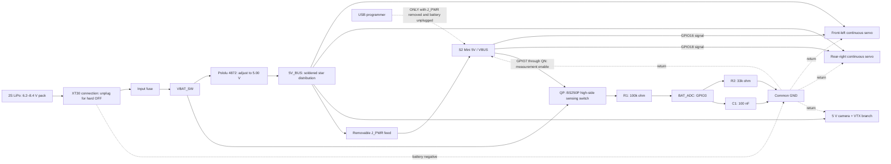
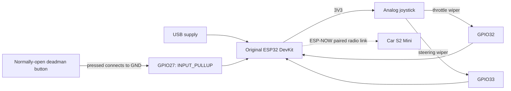

# Prototype wiring and commissioning

This is a soldered-harness design, not a manufactured PCB or a tested electrical assembly. Read [the battery/power design](../docs/power.md) before connecting a battery. All pin names below are **GPIO/net labels**, not connector positions. Identify the actual board revision and read its silkscreen/schematic; do not count holes from a photo or assume wire colors prove polarity.

## Car topology



The ground node represents a continuous electrical connection between battery negative, regulator GND, both servo grounds, S2 Mini GND, camera ground and the divider bottom. It is not an additional positive supply wire. Keep the radio antennas away from the power converter and motor wires.

## Car net table

| Net / component label | Connect to | Requirement |
|---|---|---|
| Battery positive, XT30 harness side | Input fuse, then `VBAT_SW` | Preserve original battery leads; verify connector polarity |
| `VBAT_SW` | Regulator `VIN`; QP source | Raw 2S voltage; **never** connect directly to a servo, MCU pin or camera |
| Battery negative | Regulator `GND` and star ground | 22 AWG or thicker supply wiring |
| Regulator `VOUT` | `5V_BUS` | Adjust to **5.00 V** with loads disconnected first |
| `5V_BUS` | Both servo supply inputs; camera supply; `J_PWR` | Separate branches; no motor current through the MCU board |
| `J_PWR` removable feed | S2 Mini pin labeled `5V` / VBUS, according to its schematic | Remove this connection during USB programming |
| S2 Mini `GND` | Star ground | Ground must be common for PWM signaling |
| S2 Mini **GPIO16** | Front-left servo signal | Firmware `LEFT_SERVO_PIN`; initially direct 3.3 V logic |
| S2 Mini **GPIO18** | Rear-right servo signal | Firmware `RIGHT_SERVO_PIN`; initially direct 3.3 V logic |
| Both servo grounds | Star ground | Identify ground/supply/signal from delivered units; no assumed contact order |
| Camera `VCC` / power input | Separate `5V_BUS` branch | Verify the delivered camera's allowed supply before connecting |
| Camera `GND` | Separate return to star | AIO analog camera/VTX does not send video through the ESP32 |
| R1 **100 kΩ, 1%** | QP drain / `VBAT_SENSE` → `BAT_ADC` | Upper divider resistor; do not bypass QP |
| R2 **33 kΩ, 1%** | `BAT_ADC` → GND | Lower divider resistor |
| C1 **100 nF ceramic, ≥16 V** | `BAT_ADC` → GND | Place beside GPIO3 and R2 |
| S2 Mini **GPIO3** | `BAT_ADC` | This is **GPIO3 / ADC1_CH2**, not “ADC channel 3” |
| S2 Mini **GPIO7** | 10 kΩ → QN base | Battery-sense enable; LOW except during a settled measurement |
| QP **Diodes BS250P** | Source = `VBAT_SW`; drain = `VBAT_SENSE`; gate = `SENSE_GATE` | P-channel high-side switch; source/drain orientation is essential |
| QN **onsemi 2N3904BU** | Emitter = GND; collector through 10 kΩ to `SENSE_GATE` | Base control isolated from pack-voltage gate node |
| R_GATE **100 kΩ** | QP gate → QP source | Default OFF pull-up |
| R_GATE_SER **10 kΩ** | QP gate → QN collector | Limits gate pull-down current |
| R_BASE **10 kΩ** | GPIO7 → QN base | Limits GPIO/base current |
| R_BASE_PD **100 kΩ** | QN base → GND | Default OFF when MCU is unpowered/reset |
| Regulator `EN` | Leave normal cutoff circuitry intact; optional switch to GND | A switch here is standby only |
| Regulator `PG` | Leave unconnected for baseline | Do not connect to MCU without considering its open-drain interface |
| Battery three-contact balance connector | Compatible 2S charger / cell-voltage measuring tool | No assumed left-to-right contact order; consult pack/charger instructions |

The S2 assignments are supported by [Espressif's GPIO reference](https://docs.espressif.com/projects/esp-idf/en/stable/esp32s2/api-reference/peripherals/gpio.html). The genuine board's power connection must be checked against the [LOLIN S2 Mini schematic](https://www.wemos.cc/en/latest/_static/files/sch_s2_mini_v1.0.0.pdf), particularly for clones.

Use **1000 µF / 10 V** bulk capacitance at the servo split, and **100 µF / 10 V plus 100 nF** near the logic/camera branch, as described in [power.md](../docs/power.md). Connect electrolytic positive to 5 V and negative to GND. Wire these parts with short leads, heatshrink over exposed joints and strain relief. Signal/divider circuits can use small perfboard; the power harness should use adequate copper and solder joints, not skinny perfboard traces or solderless breadboard contacts.

### Switched battery sensing

With the specified resistor values:

```text
V_ADC  = V_pack × 33 / (100 + 33)
V_pack = V_ADC × 133 / 33

8.40 V pack -> 2.084 V ADC
7.00 V pack -> 1.737 V ADC
6.20 V pack -> 1.538 V ADC
```

At 8.4 V, divider current is approximately 63 µA. Its Thevenin resistance is about 24.8 kΩ; the 100 nF capacitor gives about 2.5 ms time constant. Allow settling and calibrate ADC readings against a multimeter at multiple pack voltages. Configure an ADC input range that covers at least 2.1 V; do not assume a raw count maps linearly to an ideal 3.3 V reference. The firmware's ratio is `133.0 / 33.0`; scale and offset remain calibration values.

The **mandatory high-side sensing switch** prevents the battery from continuously feeding the ADC when regulator output or MCU power disappears. It is two through-hole transistors and four extra resistors; mount it on a small insulated perfboard beside the divider. It is not a motor power switch.

```text
VBAT_SW -----------+----- QP source (BS250P)
                   |            drain -------- VBAT_SENSE -- R1 100k -- BAT_ADC -- GPIO3
               R_GATE 100k                                            |
                   |                                                 +-- R2 33k -- GND
SENSE_GATE --------+----- QP gate                                     +-- C1 100nF -- GND
                   |
             R_GATE_SER 10k
                   |
             QN collector (2N3904)
GPIO7 -- R_BASE 10k -- QN base
                          |
                      R_BASE_PD 100k
                          |
GND ----------------------+-- QN emitter
```

With GPIO7 LOW, unpowered or high-impedance during reset, QN is off and R_GATE pulls the P-MOS gate to its source, turning QP off. When GPIO7 is HIGH, QN pulls the gate down and QP connects the divider. At 8.4 V input, the gate network draws approximately 76 µA and gives about −7.5 V gate-to-source drive. Near 6.2 V, it gives about −5.5 V. Divider load is only about 63 µA maximum. These are circuit calculations, not measurements.

Firmware must initialize GPIO7 LOW, set it HIGH to measure, wait **at least 20 ms**, sample/calibrate GPIO3, then return GPIO7 LOW. A very low sample with sense enabled is a fault, not permission to drive. During a terminal stop, leave GPIO7 LOW. The RC filter discharges after sensing turns off; verify the actual ADC node falls near ground within 20 ms and remains low with the MCU supply off and the battery feed still present. Off leakage is not mathematically zero, and the small capacitor retains transient charge; this change removes the sustained battery-fed path. Physical XT30 disconnection is still the normal storage OFF.

For the selected **Diodes BS250P**, the manufacturer's illustrated leads are labeled **D, G, S** on its first-page package drawing. Use that exact drawing orientation; do not substitute a BS250 from another maker by appearance. Its limits are −45 V drain/source, ±20 V gate/source and −230 mA continuous, comfortably above this sensing circuit's electrical stress. Its specified off leakage is at most 500 nA at 25°C/−25 V, which would develop only 16.5 mV across R2. [Diodes datasheet](https://www.diodes.com/datasheet/download/BS250P.pdf)

For **onsemi 2N3904BU**, the selected manufacturer's pin numbering is **1 emitter, 2 base, 3 collector**; follow the package-view diagram before soldering. It is rated for 40 V collector/emitter and 200 mA, while this circuit sinks well below 1 mA. [onsemi datasheet](https://www.onsemi.com/download/data-sheet/pdf/2n3904-d.pdf)

BS250P is a practical stocked prototype part but is **NRND / last-time-buy**, so a future production revision should reselect its MOSFET. DigiKey listed 21,254 units and $1.75 at the research snapshot; the last-time-buy date shown was 2027-01-06. A substitute requires a new pinout/leakage/drive review. [Manufacturer lifecycle](https://www.diodes.com/part/view/BS250P), [supplier listing](https://www.digikey.com/en/products/detail/diodes-incorporated/bs250p/92630)

This still measures total pack voltage, not individual cells, and does not replace the regulator cutoff or balance charging.

The normal firmware battery stop is **7.0 V**, with a **6.2 V hardware backup**. Follow the regulator's measured cutoff/restart setup in [power.md](../docs/power.md); its hysteresis makes a naive 7 V hardware setting unsuitable. Firmware calibration flags are deliberately false until readings and neutral behavior have been verified.

## Handheld transmitter

Use an **original ESP32 development board** with GPIO32 and GPIO33 exposed for this pin map. This is a second controller; the same map is not interchangeable with the S2 Mini. A simple two-axis analog joystick and normally-open momentary deadman switch are sufficient. Power the transmitter through its own USB supply for the prototype.



| Transmitter pin / net | Connect to |
|---|---|
| ESP32 `3V3` | Joystick supply; **do not use 5 V** |
| ESP32 `GND` | Joystick ground and one deadman switch contact |
| **GPIO32** | Joystick throttle-axis wiper, firmware `THROTTLE_PIN` |
| **GPIO33** | Joystick steering-axis wiper, firmware `STEERING_PIN` |
| **GPIO27** | Other contact of a normally-open momentary switch; firmware uses internal pull-up |
| Joystick click switch | Leave unconnected unless intentionally used as the deadman and verified |

GPIO32/33 are ADC1 inputs on the original ESP32, allowing the joystick to avoid ADC2/Wi-Fi contention. [Espressif DevKitC reference](https://documentation.espressif.com/api/resource/path/docs/projects/esp-dev-kits/en/latest/esp32/esp32-devkitc/user_guide.html)

No ground wire runs between handheld and car: they have separate supplies and communicate by radio. Calibrate each joystick's minimum, center, maximum, direction and dead zone in the transmitter config. Verify that a released or disconnected deadman means stop. Store your actual peer addresses and unique encryption keys locally; never publish those credentials in the public repository.

## If a servo rejects 3.3 V signals

First confirm shared ground, 5 V at the servo connector, correct pulse timing and the delivered servo's input specification. If it requires a higher logic-high level, add a **SN74AHCT125N** buffer powered from the same regulated 5 V rail, with 100 nF bypass at VCC/GND. Its TTL-compatible input recognizes a 3.3 V high; AHCT is deliberate, and an arbitrary HC buffer is not an equivalent choice. [TI datasheet](https://www.ti.com/lit/ds/symlink/sn74ahct125.pdf)

Use these **signal names**, locating the exact package pins from TI's diagram: GPIO16 → `1A`, `1Y` → left signal; GPIO18 → `2A`, `2Y` → right signal; active channels' `/OE` → GND. Add 10 kΩ pull-downs to the two used A inputs so reset inputs do not float. Disable unused channels by taking `/OE` to VCC and tie their A inputs to GND; leave unused Y outputs open. Never connect a 5 V Y output to the ESP32. Disconnect signals while independently programming an unpowered buffer/servo assembly; this optional circuit has not been added to the baseline mechanical model or validated on the user's servos.

## Staged bench test

1. **Inspect unpowered.** Confirm model labels and connector functions, no shorts between supply and GND, correct resistor values and capacitor polarity. Fit no wheels initially. Mark the XT30 disconnect so it is easy to reach.
2. **Flash using isolated USB power.** Unplug the battery, remove `J_PWR`, and unplug servo signals. Flash each controller and record the private peer addresses. Do not enable calibration flags simply to make the wheels move.
3. **Commission the regulator alone.** Disconnect all loads and the ADC harness. Set 5.00 V, set the 6.2 V backup cutoff, and verify falling cutoff and rising restart using a multimeter and adjustable supply. Recheck 5 V before reconnecting anything. The selected charger can supply a variable voltage in its documented digital-power mode; keep battery charging and bench-supply use separate.
4. **Commission the receiver and divider.** Remove USB, restore `J_PWR`, and power from a current-limited supply. With the ADC lead disconnected from the MCU, verify the sensing switch: GPIO7 LOW/reset gives a near-zero node; GPIO7 HIGH gives approximately 2.084 V at the node for 8.4 V pack input after settling. Then attach GPIO3 and check/calibrate readings at several voltages. Verify sensing returns off when MCU power is removed, with the battery feed still present. Keep servo outputs disconnected.
5. **Commission one servo at a time.** With the shaft unloaded and an immediately accessible power disconnect, determine whether the unit is continuous rotation, determine its actual neutral, and confirm direction at small pulse offsets. Missing PWM is not a guaranteed stop for every servo. Record the neutral values before enabling drive.
6. **Test the radio controls with the wheels lifted.** Establish pairing, confirm neutral on startup, deadman release, transmitter shutdown and radio loss. Test both wheels' forward direction and steering sign. Match the real loss timeout and battery-stop behavior to the firmware; do not infer these from a moving-wheel demonstration alone.
7. **Test low battery without discharging a pack deeply.** Use the adjustable supply to sweep past the normal 7.0 V stop and verify neutral/latching behavior. Verify the sensing switch turns off and the ADC node falls near ground when the hardware cutoff removes MCU power. Do not turn this into an intentional deep-discharge test of the LiPo.
8. **Add camera and realistic load.** Attach the camera's correct antenna before powering its VTX. Exercise both servos and radio together, measure current, and check for receiver resets/video interference. Observe regulator temperature in the enclosure and test expected low-voltage load conditions. Do not hold a tiny servo stalled.
9. **Finish the harness only after the checks pass.** Insulate and strain-relieve every joint, verify no pouch contact with screws/sharp edges, and perform a short supervised floor run. Record measured runtime and both cell voltages. Remove the battery for charging/storage and unplug after every run.

The unresolved gates are actual servo current/neutral/logic compatibility, camera supply confirmation, ADC calibration and measured power-off isolation, low-battery behavior, radio fail-safe behavior, and enclosure thermal performance. These are hardware verification tasks; CAD renders and successful code compilation do not establish them.
