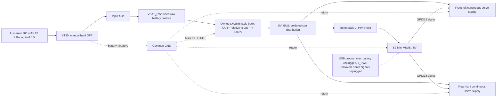
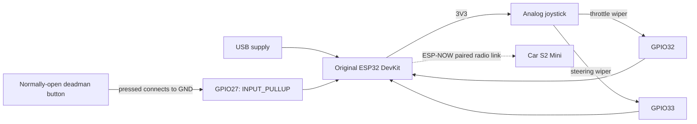

# Camera-free wiring and commissioning

**Current selection: the owned large LM2596-style adjustable buck, a Lumenier 300 mAh 2S LiPo with XT30, the S2 Mini, and two continuous-rotation servos.** This is a soldered harness and an untested electrical assembly. Use the [picture wiring guide](../output/pdf/spy-car-wiring-guide.pdf) and [current camera-free BOM](camera-free-bom.csv). The earlier Tattu/Pololu/FPV proposal in `docs/power.md` and root `BOM.md` is historical and does not describe this wiring.

The battery is 7.4 V nominal and 8.4 V fully charged. Adjust the converter output to **5.00 V before connecting any loads**. “LM2596-style” identifies the module family, not a verified manufacturer, continuous-current rating or protection specification. Confirm the markings and polarity on the owned board. No charger, servo motor driver or custom PCB is required on the car; each continuous servo contains its own motor driver.

Browser remote control runs on the existing S2 Mini and adds no wiring or hardware. A phone replaces the optional ESP-NOW handheld. See [browser setup](../firmware/README.md#browser-remote-control); manual battery checks and the USB-isolation requirements below still apply. There is no battery-sensing perfboard in the current build.

## Car topology

`VBAT_SW` is the existing firmware/documentation net name for the fused battery feed; it does not imply an automatic power switch. Ground is a continuous electrical connection between battery negative, buck input/output negative, both servo grounds and S2 Mini GND. Confirm input-negative/output-negative continuity with the converter unpowered. Keep servo current in the power harness, not through the S2 board, a GPIO, USB connector or solderless breadboard. Keep the ESP32 antenna away from the converter and motor wiring.

## Car net table

| Net / component label | Connect to | Requirement |
|---|---|---|
| Battery positive, XT30 harness side | Input fuse, then `VBAT_SW` | Preserve original battery leads; verify mating connector polarity |
| `VBAT_SW` | Buck `IN+` | Raw 2S voltage; never connect directly to a servo, S2 VBUS, 3V3 or GPIO |
| Battery negative | Buck `IN−` and common ground | Short 22 AWG or thicker supply wiring |
| Buck `OUT+` | `5V_BUS` | Set and measure **5.00 V** with all loads disconnected first |
| Buck `OUT−` | Common ground / soldered return distribution | Separate return branches for both servos and S2 |
| `5V_BUS` | Both servo positive supply inputs; `J_PWR` | Separate branches; no motor current through the MCU board |
| `J_PWR` removable feed | S2 Mini **VBUS / 5V** | Remove this feed before USB programming |
| S2 Mini `GND` | Common ground | Required for servo PWM signaling |
| S2 Mini **GPIO16** | Front-left servo signal | Firmware `LEFT_SERVO_PIN`; initially direct 3.3 V logic |
| S2 Mini **GPIO18** | Rear-right servo signal | Firmware `RIGHT_SERVO_PIN`; **not GPIO17** |
| Both servo grounds | Common ground | Identify supply, ground and signal from the actual units; colors/contact order are not proof |
| C_BULK **220 µF / 10 V** | Positive to `5V_BUS`; negative to GND | External capacitor near the servo power split; polarity matters |
| C_BYPASS **100 nF ceramic** | S2 `VBUS` after `J_PWR` to GND | Short leads at the S2 supply pads |
| Battery three-contact balance connector | Compatible 2S balance charger / manual per-cell meter | Verify connector orientation and cell taps; never connect it directly to S2 pins |

Use a DC-rated input fuse in an insulated assembly selected for the battery fault current, wiring and measured inrush; do not call the fuse servo-stall protection. Keep supply/return wires short and use heatshrink and strain relief. The external **220 µF / 10 V plus 100 nF** values are starting decoupling, not a verified fix for voltage dips or inadequate converter capacity. Leave the buck's fitted capacitors in place. Use insulated soldered joints for power distribution. No perfboard, sensing transistors, sensing resistors, ADC filter, or GPIO3/GPIO7 wires are fitted.

## Exact S2 Mini pads

The following positions are verified against the [official WEMOS pinout](https://docs.wemos.cc/en/latest/_images/s2_mini_v1.0.0_4_16x9.jpg). Hold the **component side toward you, antenna at the top, USB-C at the bottom**. Count only the eight small electrical pads in a column, starting at the top; ignore the large mounting holes. The underside is mirrored. Confirm the owned board revision and underside silkscreen before soldering.

| Required net | Physical pad in that top-view orientation | Neighbor that helps identify it |
|---|---|---|
| Regulated 5 V input | **Right outer column, row 8: VBUS** | Right inner row 8 is GPIO15; do not use it for power |
| GND | **Right outer column, row 7** | Right inner row 7 is also GND |
| Left servo signal GPIO16 | **Right outer column, row 6** | Right inner row 6 is GPIO17; not the right-servo signal |
| Right servo signal GPIO18 | **Right outer column, row 5** | Right inner row 5 is GPIO21 |

For a second check, the complete right outer column from top to bottom is **39, 37, 35, 33, 18, 16, GND, VBUS**. GPIO runs at 3.3 V. The genuine board's [V1.0.0 schematic](https://docs.wemos.cc/en/latest/_static/files/sch_s2_mini_v1.0.0.pdf) directly connects the header VBUS and USB VBUS net. Before plugging in powered USB, **unplug the battery, remove `J_PWR`, and unplug both servo signals**. Removing the battery alone does not isolate an attached buck/output harness from USB backfeed. Restore external wiring only after removing USB power. Check clone boards separately.

For routine receiver programming, use the [parked Wi-Fi update mode](../firmware/README.md#wireless-receiver-updates) after its initial USB installation. With **USB unplugged**, the battery, buck, `J_PWR`, and calibrated servo connections can stay in place; lift the wheels and verify behavior during reboot. The built-in BOOT/0 button enters maintenance after startup, so this adds no switch or wiring. The USB isolation instructions above and in the illustrated PDF remain necessary for initial setup and recovery. `J_PWR` is our name for a mating insulated connector in the positive 5 V feed to VBUS, not a component built into the S2 Mini. The two connector halves remain joined during normal battery-powered use; ground is continuous. Its exact connector family and package are not selected, so the Blender housing is a labeled allowance, not a purchase specification.

**Current versus planned Wi-Fi updates:** browser driving on configured home Wi-Fi works now. The current updater always creates `SpyCar-Update`, reached at `http://192.168.4.1/update` after holding BOOT/0 for three seconds after startup. The agreed home-Wi-Fi-first updater at `http://spy-car.local/update`, with AP fallback, is a planned software change; do not expect that route to work yet. Neither approach needs a change to this power wiring.

## Load and shutdown limits

The provisional 5 V peak budget is **2.8 A**: 1.2 A per servo plus 0.4 A for the S2. These are planning allowances, not measured specifications for the owned servos. The converter's suitability remains unverified even if its listing or IC says “3 A.” Check both servos starting and reversing together, voltage at the S2/servo connectors, and converter temperature at the full pack and at 7 V input on a bench supply. A multimeter can miss short dips; use a scope if available. Do not hold the servos stalled. Reduce the load or replace the converter if the rail falls out of regulation, the board resets or the module overheats.

## Manual battery checks - no onboard low-voltage protection

The current POC deliberately removes the battery-sensing circuit. **The receiver does not measure battery voltage or stop for a low battery.** There is no battery value to calibrate, no battery telemetry, no alarm and no automatic low-voltage disconnect. The fuse protects against sufficiently large overcurrent; it cannot protect against over-discharge. Joystick release and lost-link stopping still work, but they do not disconnect power.

Use your multimeter before and between short, attended runs, with the **XT30 unplugged from the car**:

1. Select DC volts with leads in COM and V, never the current socket/range. Prefer an insulated mating balance breakout so probe tips cannot short adjacent contacts.
2. Identify the balance connector's three taps: pack negative, cell midpoint, pack positive. Do not assume a physical left/right orientation or wire colors. Across the two end taps is total pack voltage; each adjacent pair measures one cell. Verify polarity and use the actual pack/charger instructions to identify contacts.
3. Record **each cell separately**. A healthy total voltage alone can hide a depleted cell. Start with a correctly balance-charged pack and use very short trials while establishing real runtime.
4. For this attended POC, **end the session when either cell is at or below 3.7 V at rest**, or earlier if the pack maker specifies a higher limit. This is a deliberately early project stopping point, not a manufacturer minimum or a guarantee against dips during a run. If either cell is already 3.5 V or lower, do not do another run; recharge appropriately. Do not run down to the absolute discharge limit.
5. Keep XT30 disconnected whenever parked, measuring, charging or storing. Stop immediately for abnormal heating, puffing, unexpected slowing or resets; do not use those symptoms as a normal low-battery indicator.

Periodic checks cannot catch a rapid drop or weak cell between measurements. No safe fixed runtime has been measured for this build. If you want longer runs without these interruptions, add a suitable per-cell monitor/cutoff in a future revision. Use a compatible external **2S LiPo balance charger**, correct pack settings and the manufacturer's instructions; never a 1S TP4056 charger. For OTA, start with a freshly balance-charged pack, keep wheels lifted and USB unplugged; firmware does not check the battery before or during an update.

## Optional handheld transmitter

Use an **original ESP32 development board** with GPIO32 and GPIO33 exposed for this pin map. This is a second controller; the same map is not interchangeable with the S2 Mini. A simple two-axis analog joystick and normally-open momentary deadman switch are sufficient. Power the transmitter through its own USB supply for the prototype.

| Transmitter pin / net | Connect to |
|---|---|
| ESP32 `3V3` | Joystick supply; **do not use 5 V** |
| ESP32 `GND` | Joystick ground and one deadman switch contact |
| **GPIO32** | Joystick throttle-axis wiper, firmware `THROTTLE_PIN` |
| **GPIO33** | Joystick steering-axis wiper, firmware `STEERING_PIN` |
| **GPIO27** | Other contact of a normally-open momentary switch; firmware uses internal pull-up |
| Joystick click switch | Leave unconnected unless intentionally used as the deadman and verified |

GPIO32/33 are ADC1 inputs on the original ESP32, allowing the joystick to avoid ADC2/Wi-Fi contention. [Espressif DevKitC reference](https://documentation.espressif.com/api/resource/path/docs/projects/esp-dev-kits/en/latest/esp32/esp32-devkitc/user_guide.html)

No ground wire runs between handheld and car: they have separate supplies and communicate by radio. Calibrate each joystick's minimum, center, maximum, direction and dead zone in the transmitter config. Verify that a released or disconnected deadman means stop. Store your actual peer addresses and unique encryption keys locally; never publish those credentials in the public repository.

## If a servo rejects 3.3 V signals

First confirm shared ground, 5 V at the servo connector, correct pulse timing and the delivered servo's input specification. If it requires a higher logic-high level, add a **SN74AHCT125N** buffer powered from the same regulated 5 V rail, with 100 nF bypass at VCC/GND. Its TTL-compatible input recognizes a 3.3 V high; AHCT is deliberate, and an arbitrary HC buffer is not an equivalent choice. [TI datasheet](https://www.ti.com/lit/ds/symlink/sn74ahct125.pdf)

Use these **signal names**, locating the exact package pins from TI's diagram: GPIO16 → `1A`, `1Y` → left signal; GPIO18 → `2A`, `2Y` → right signal; active channels' `/OE` → GND. Add 10 kΩ pull-downs to the two used A inputs so reset inputs do not float. Disable unused channels by taking `/OE` to VCC and tie their A inputs to GND; leave unused Y outputs open. Never connect a 5 V Y output to the ESP32. Disconnect signals while independently programming an unpowered buffer/servo assembly; this optional circuit has not been added to the baseline mechanical model or validated on the user's servos.

## Staged bench test

1. **Inspect unpowered.** Confirm actual board labels, battery connector polarity, the two converter input/output pairs, capacitor polarity. Check for supply-to-ground shorts. Leave wheels off and keep the XT30 disconnect accessible.
2. **Flash using isolated USB power.** Unplug the battery, remove `J_PWR`, and unplug both servo signals. Flash the S2 receiver and configure your private Wi-Fi settings for browser driving. A second controller and pairing keys are needed only for optional ESP-NOW mode. Servo calibration deliberately remains false until tested; do not enable it merely to force motion.
3. **Commission the buck alone.** Disconnect every load. Apply a current-limited input supply within the 2S operating range, identify the output-adjustment potentiometer, and set `OUT+` to `OUT−` to 5.00 V. Recheck across the expected input range, including near 7 V. No battery-cutoff setting or exposed enable/power-good interface is assumed for this owned module.
4. **Commission the receiver.** Remove USB, restore `J_PWR`, and use the current-limited supply. Confirm 5.00 V at VBUS and the correct firmware configuration for this manual-check build. Leave GPIO3 and GPIO7 unwired. Keep servo outputs disconnected until the next step.
5. **Commission one servo at a time.** Confirm continuous rotation, actual neutral and direction using small pulse offsets with the shaft unloaded. Missing PWM is not a guaranteed stop for every clone. Verify 3.3 V signal compatibility and keep the power disconnect reachable. Record each neutral before enabling drive.
6. **Check browser control with wheels lifted.** Open `http://spy-car.local/` on the same configured home Wi-Fi. Verify startup, calibrated neutral, joystick release, tab hiding and Wi-Fi loss. Confirm forward/reverse and both turn directions. A fresh hold must be required after reconnecting; servo calibration must be verified. Optional ESP-NOW mode separately requires paired keys and handheld checks.
7. **Check the manual-check workflow.** Confirm the receiver does not claim battery voltage or low-battery protection. Practice unplugging XT30 and measuring both cells without bridging contacts. Record an initial short-run duration and per-cell voltages; no runtime estimate is a substitute for measurements.
8. **Validate realistic combined load.** Exercise both servos and Wi-Fi together, measure current, observe supply dips and check the buck's temperature in its intended mounting. Test near 7 V input as well as at full input voltage. The 2.8 A budget and external capacitor values are provisional until these checks pass.
9. **Finish and test briefly.** Insulate and strain-relieve joints, keep screws/sharp edges away from the pouch, and perform a short supervised smooth-floor run. Record each cell voltage and measured runtime. Unplug XT30 after every run and remove the pack for balance charging or storage.

Actual servo current, neutral, logic compatibility, USB power isolation, radio failsafe and converter thermal/load performance remain hardware validation tasks. CAD renders and successful code compilation do not establish these results.

## Fuse photograph and the under-deck components

The illustrated guide shows a Littelfuse PICO II 251 family reference photograph on pages 1 and 6. A compact **candidate**, not a tested final selection, is [0251004.MXL](https://www.digikey.com/en/products/detail/littelfuse-inc/0251004-MXL/700745): 4 A very fast acting, rated 125 V DC with 300 A DC interrupt capacity. The [manufacturer drawing](https://www.littelfuse.com/assetdocs/littelfuse_fuse_251_253_datasheet.pdf?assetguid=f47a0bb7-8ede-4679-9646-7114c3787688) gives a 7.11 mm body length and 2.80 mm maximum diameter. Leave additional room for leads, insulation and strain relief. Validate the candidate against measured inrush, wiring and prospective fault current. This is not an instantaneous 4 A limiter.

Wire this non-polar axial fuse in series near the battery connector in the **positive harness lead**, before the buck. Solder and insulate it with strain relief; an axial part does not need a cartridge holder. It is not resettable. The updated Blender fuse follows the nominal 7.11 mm body length and 2.80 mm maximum diameter, with 0.64 mm leads. Lead bends and insulation are assembly allowances; the retained loose carrier and strain relief need a physical fit check.

The former battery-sensing perfboard and all of its parts have been removed. The retained 220 µF bulk capacitor and 100 nF bypass capacitor are wired directly into the power harness at the servo split and S2 supply respectively. Neither these capacitors nor the fuse provide charging or an automatic low-voltage power disconnect.
